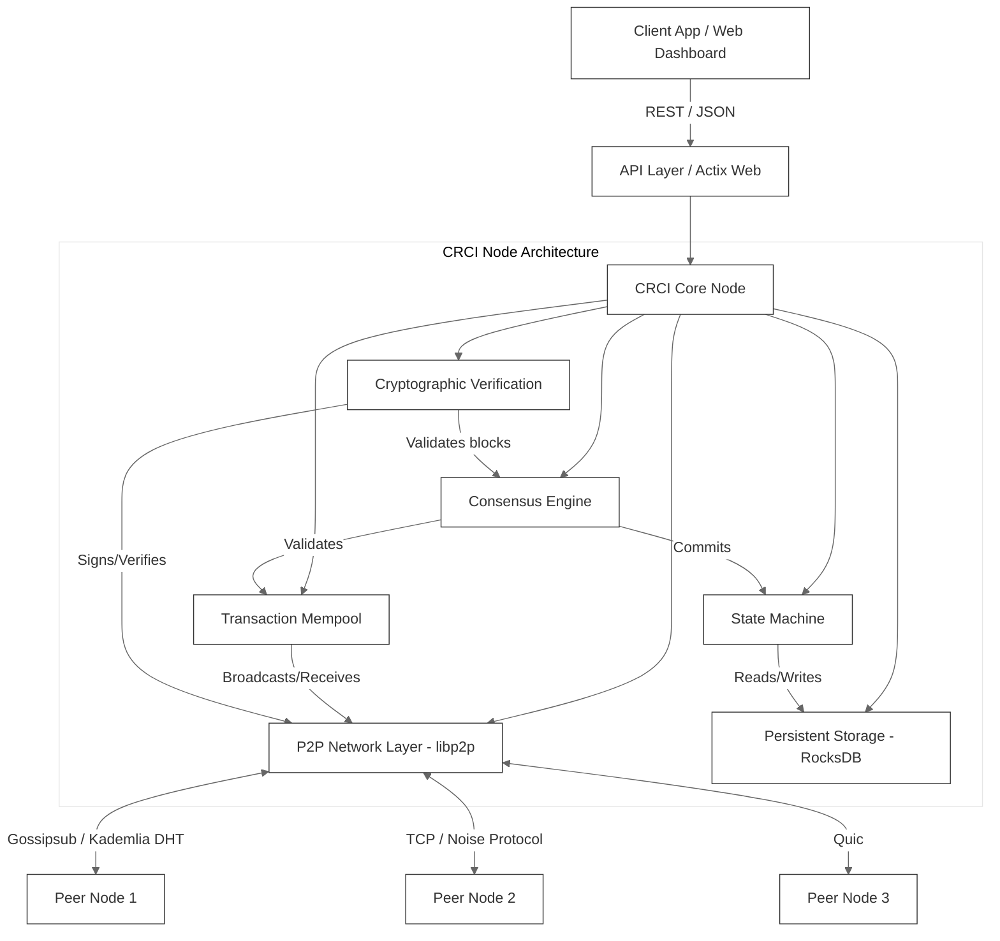

# CRCI (Consensus Rules & Cryptographic Integrity)

CRCI is a distributed systems framework designed to maintain strict state consistency and network integrity across malicious or failing nodes.

## The Problem

In distributed systems, trust is often implicitly assumed between nodes on the network. When nodes become malicious or undergo Byzantine faults (e.g., sending conflicting information, forging messages, or dropping traffic), standard consensus protocols can break down, leading to divergent state or network partitions. Securing a network against these faults typically requires heavy cryptographic overhead and rigid topology assumptions, making it difficult to maintain performance under real-world WAN conditions.

## The Solution

CRCI introduces a resilient, cryptographically hardened peer-to-peer architecture built on `rust-libp2p`. It enforces strict Byzantine fault tolerance (BFT) via multi-layered validation, isolating malicious actors by tracking reputation and dynamically evicting nodes that violate consensus rules. By treating all inbound data as untrusted and requiring cryptographic proof for state transitions, CRCI ensures that the network converges to a single correct state even when a subset of nodes actively attempt to sabotage it. 

## Architecture



## Key Results

- **Test Suite**: Backed by 197 passing tests (196 local unit/integration tests + 1 CI-only integration test).
- **WAN Chaos Testing**: Successfully converges under simulated real-world WAN conditions (packet loss, high latency). *Note: The real network-namespace-based WAN chaos test (`chaos_wan_real_tests.rs`) runs a downscaled 5-node topology due to CI runner constraints. Larger node-count figures found in earlier documentation refer to an in-process simulation (`chaos_wan_100_tests.rs`), which is not the same class of evidence.*
- **Continuous Integration**: Green across all jobs (Ubuntu, Windows, and cross-compilation) for the `test_real_wan_chaos_netns` execution (verified under CI Run ID: `34764207118`).

## Quick Start

CRCI has been reorganized into a Cargo workspace. To build and run the project:

```bash
# Build the entire workspace
cargo build --workspace

# Run the test suite
cargo test --workspace

# Run a local CRCI node
cargo run --bin node
```

## Documentation & Papers

- [**CRCI Academic Paper (`docs/paper.md`)**](docs/paper.md): The formal research paper and architectural overview.
