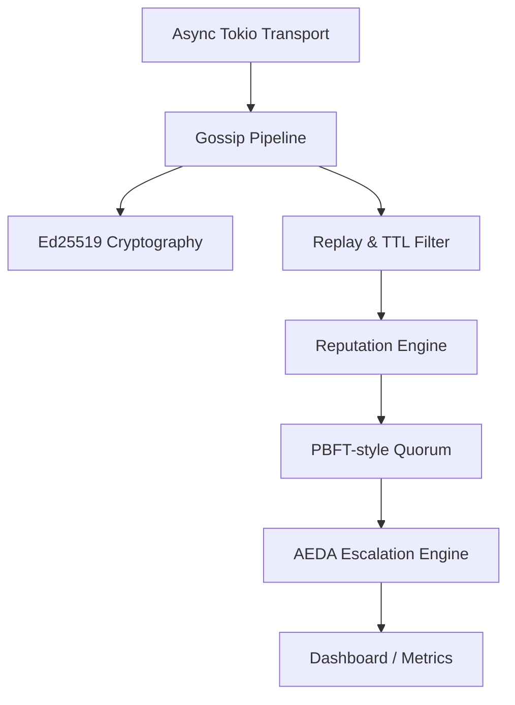

[](https://github.com/medwinjose/crci/actions/workflows/ci.yml)
[](LICENSE)
[](https://www.rust-lang.org/)
[](https://github.com/medwinjose/crci/commits/main)

# CRCI (Crisis Response Communication Infrastructure)

CRCI is a production-grade distributed mesh networking system in Rust designed for high-latency, low-bandwidth environments where traditional communication infrastructure has collapsed. It provides Byzantine fault tolerance, decentralized reputation consensus, and automated crisis severity escalation entirely without a central server.

## Architecture Overview



## Quick Start

```bash
cargo build --release
cargo test --all
cargo run --bin crci
```

Plus: `docker compose up` for the multi-node proof loop.

## Feature Matrix

| Feature | Status | Notes |
|---------|--------|-------|
| Ed25519 signatures | ✅ Complete | Cryptographic origin authentication |
| Byzantine fault detection | ✅ Complete | Malicious severity injection isolated |
| Reputation-weighted consensus | ✅ Complete | O(n) localized quorum replacement for PBFT |
| Zone-isolated consensus | ✅ Complete | Geographic boundaries respected |
| Gossip with replay protection | ✅ Complete | Minimum sequence enforcement |
| K-bucket peer discovery | ✅ Complete | XOR distance routing |
| Async TCP transport | ✅ Complete | `tokio::net` implemented |
| Prometheus metrics | ✅ Complete | Live dashboard integration |
| AEDA autonomous decisions | ✅ Complete | Automated Escalation and Disinfo Analysis |
| Battery-aware throttling | ✅ Complete | Dynamic rate limiting based on drain |
| Message TTL + pruning | ✅ Complete | Storage capacity bounded |
| Input validation + rate limiting | ✅ Complete | 10 msg/sec per peer default |
| STRIDE security hardening | ✅ Complete | Verified against threat model |
| Docker multi-node proof loop | ✅ Complete | 5-node distributed testbed |
| LoRa transport | 🔧 Stub | Hardware HAL defined, calls mocked |
| BLE transport | 🔧 Stub | Under architectural review |
| React web app | 🗓 Planned | Session 40+ |
| Mobile app | 🗓 Planned | React Native integration |
| TLA+ formal spec | 🗓 Planned | Session 36 |

## Benchmark Results

*All benchmarks run on a single machine (simulated). See [docs/BENCHMARKS.md](docs/BENCHMARKS.md) for full methodology.*

| Metric | Condition | Performance |
|--------|-----------|-------------|
| Message Propagation | 10 / 100 / 1000 nodes | 3 / 8 / 15 rounds to full reach |
| Consensus Convergence | 100 nodes, 33% Byzantine | 8 rounds |
| Replay Filter Throughput | In-memory cache | 2.2M checks/s |
| Pipeline Throughput | End-to-end processing | ~94K msg/s |
| Discovery Convergence | 100 nodes | 10 rounds (<70ms) |

## Crisis Scenario Results

| Scenario | Network Size | Byzantine Nodes | Outcome |
|----------|--------------|-----------------|---------|
| Flash Flood (Tamil Nadu coast) | 8 nodes | 0 | Resource matching successfully paired 1 trapped node with 2 available responders. |
| Earthquake M7.8 | 12 nodes | 0 | MCE declared from 7 rescue requests; offline nodes' requests survived round resets. |
| Urban Conflict | 8 nodes | 3 | Enemy nodes penalized and isolated (rep dropped to 0.80) for injecting false intelligence. |
| Chemical Plant Explosion | 10 nodes | 0 | Rescue requests correctly propagated across contamination zone boundaries. |

## Known Limitations

- **Sybil resistance is partial**: Vouching exists, but a global bloom filter or proof-of-work is not yet deployed (planned Session 47).
- **LoRa/BLE transports are stubs**: The hardware HAL is defined, but physical radio calls are currently mocked (planned Session 43).
- **Key Storage**: Ed25519 keys are currently stored in memory, not in a secure HSM enclave (planned Session 33+).
- **Formal Verification**: The TLA+ specification is pending (planned Session 36).

## Roadmap

- REST API + WebSocket backend
- React web dashboard
- React Native mobile app
- 10-node Docker proof loop
- LoRa hardware integration
- Raspberry Pi cross-compilation
- Sybil resistance layer
- mdBook documentation site
- Release 1.0.0

## Documentation

- [Technical Paper](docs/paper.md)
- [Fault Model](docs/fault_model.md)
- [Architecture Decision Records](docs/adr/)
- [Benchmark Tables](docs/BENCHMARKS.md)
- [Security Policy](SECURITY.md)
- [Contributing](CONTRIBUTING.md)
