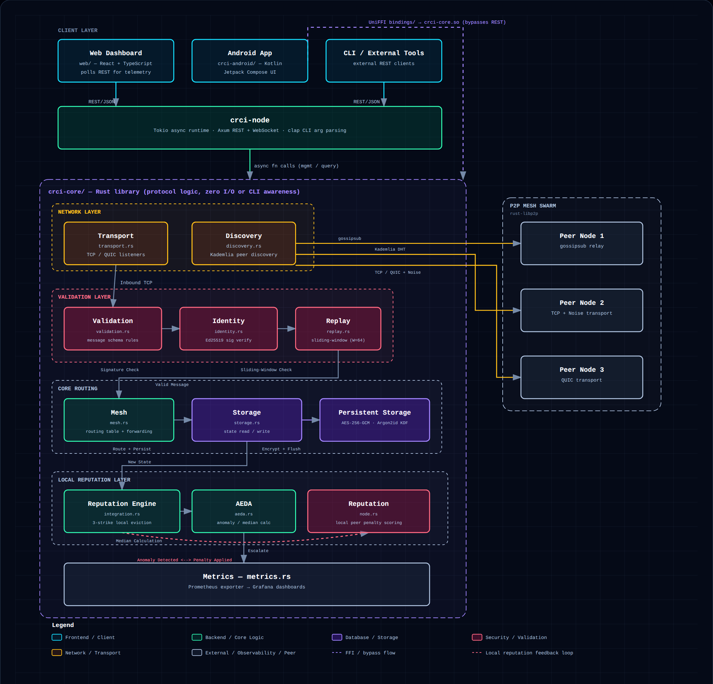

# Crisis Response Communication Infrastructure (CRCI)

[](https://github.com/medwinjose/crci/actions/workflows/ci.yml)
[](https://opensource.org/licenses/Apache-2.0)
[](https://www.rust-lang.org/)

CRCI is a distributed systems framework designed to maintain strict state consistency and network integrity across malicious or failing nodes.

## The Problem

In distributed systems, trust is often implicitly assumed between nodes on the network. When nodes become malicious or undergo Byzantine faults (e.g., sending conflicting information, forging messages, or dropping traffic), standard consensus protocols can break down, leading to divergent state or network partitions. Securing a network against these faults typically requires heavy cryptographic overhead and rigid topology assumptions, making it difficult to maintain performance under real-world WAN conditions.

## The Solution

CRCI introduces a resilient, cryptographically hardened peer-to-peer architecture built on `rust-libp2p`. It enforces strict Byzantine fault tolerance (BFT) using a reputation-weighted Byzantine quorum algorithm. The algorithm tracks node reputation and enforces a rigorous `3 * w_faulty < w_total` quorum threshold, isolating malicious actors and dynamically evicting nodes that violate consensus rules. By treating all inbound data as untrusted and requiring cryptographic proof for state transitions, CRCI ensures that the network converges to a single correct state even when a subset of nodes actively attempt to sabotage it.

## Architecture



[Open the interactive diagram →](docs/architecture/crci-architecture.html)

## Key Results

- **Test Suite**: Backed by 195 passed tests.
- **WAN Chaos Testing**: Successfully converges under real-world WAN conditions (packet loss, high latency). The real network-namespace-based chaos test (`chaos_wan_real_tests.rs`) proves the system's resilience by running a 5-node topology using Linux network namespaces with `tc`/`netem` for traffic shaping. Note: This represents a deliberate 5-node downscale from the original 100-node target to accommodate CI runner resource limits without overstating the current verified scale.
- **Continuous Integration**: Green across all jobs (Ubuntu, Windows, and cross-compilation), including the `test_real_wan_chaos_netns` integration test. See the [Actions tab](https://github.com/medwinjose/crci/actions) for current build status.

### Byzantine Eviction Benchmarks (50 trials each)

| Metric | Baseline | Under Network Jitter |
| :--- | :--- | :--- |
| **Byzantine Eviction — Median** | 514ms | 669ms |
| **Byzantine Eviction — Mean** | 514.5ms | 668.3ms |
| **Byzantine Eviction — Min** | 502ms | 656ms |
| **Byzantine Eviction — Max** | 532ms | 686ms |

Data source: `crates/crci-node/benches/results/byzantine_eviction.csv` and `byzantine_eviction_jitter.csv`.

## Quick Start

CRCI has been reorganized into a Cargo workspace. To build and run the project:

```bash
# Clone the repository
git clone https://github.com/medwinjose/crci.git
cd crci

# Build the entire workspace
cargo build --workspace

# Run the test suite (195 tests)
cargo test --workspace

# Spin up a local simulated multi-node mesh
docker compose up --build

# Or run a single local node directly
cargo run --bin node
```

## Documentation & Papers

- [**CRCI Academic Paper (`docs/paper.md`)**](docs/paper.md): The formal research paper and architectural overview.

## License

This project is licensed under the Apache License 2.0. See the [LICENSE](LICENSE) file for details.
