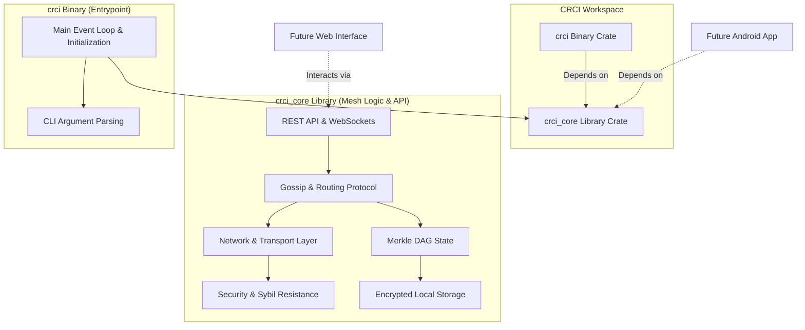

# CRCI Architecture

CRCI (Crisis Response Communication Infrastructure) is organized as a Cargo workspace with the following structure:

## Workspace Crates

- **`crci_core`**: The core library crate containing all business logic, protocol rules, cryptography, routing, Sybil resistance, state management, and API interfaces. This is completely decoupled from the binary execution loop, allowing it to be compiled into Android or iOS apps.
- **`crci`**: The primary executable wrapper that handles argument parsing (`clap`), initializing the Tokio asynchronous runtime, setting up signal handlers, and driving the simulation or physical node execution.
